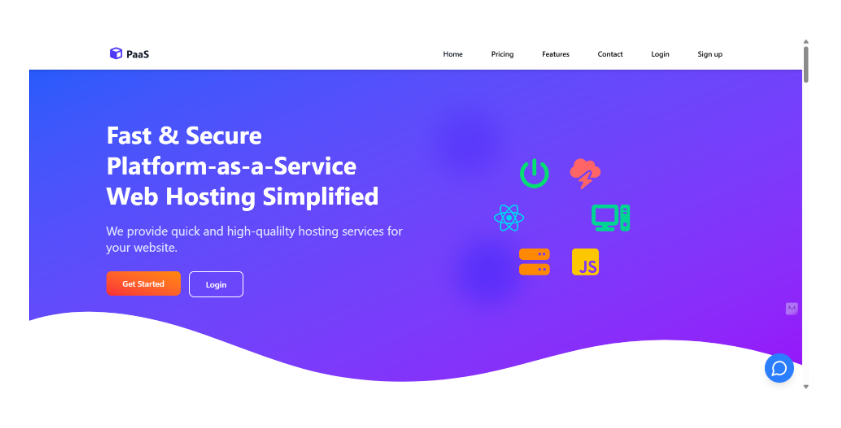
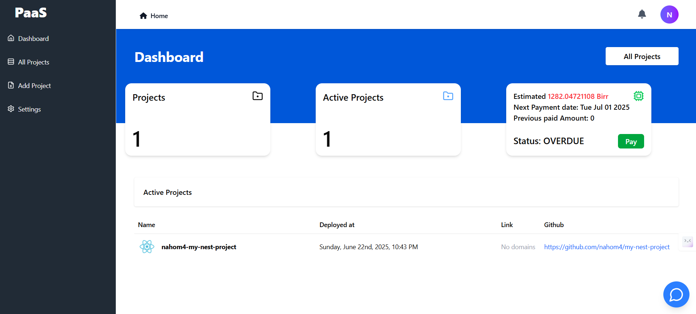
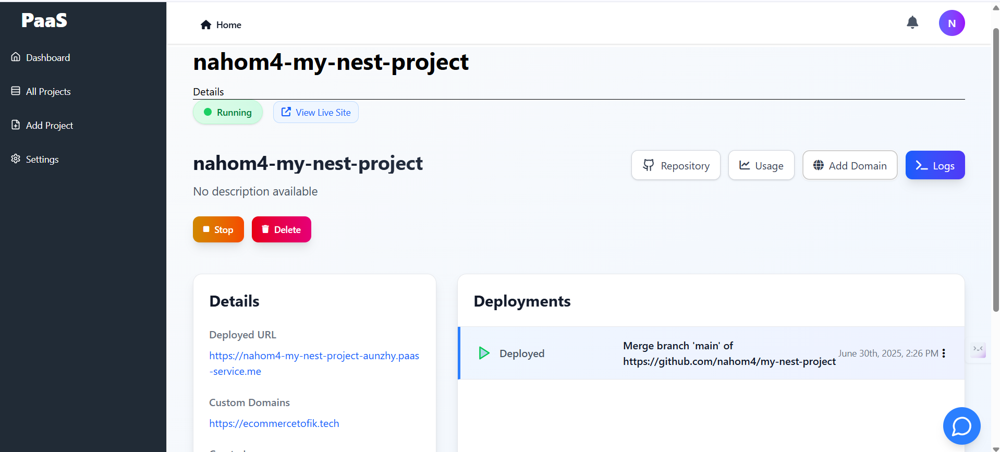
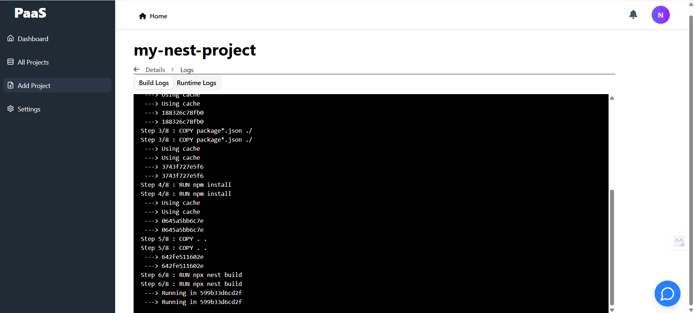

# PaaS — Push-to-Deploy Platform

**A self-hosted, Heroku-style platform-as-a-service.** Connect a GitHub repository and the platform detects the framework, builds a Docker image (streaming the build logs), deploys the container to a live subdomain with automatic TLS, supports custom domains, and meters usage for billing.

This repository is the **NestJS backend** that orchestrates the whole pipeline. The dashboard lives in [paas--frontend](https://github.com/nahom4/paas--frontend).



---

## What it does

```
Connect repo ─▶ Detect framework ─▶ Build image ─▶ Run container ─▶ Subdomain + TLS ─▶ Meter & bill
 (GitHub +        (Angular/Vue/      (Docker, live    (start/stop/     (auto domain +     (usage-based
  webhooks)        Node/Python)       build logs)      delete)          custom domains)    billing)
```

- **Git-based deploys** — connect a GitHub repo and deploy on push via webhooks.
- **Framework auto-detection** — inspects the project and generates an appropriate Dockerfile / compose config (Angular, Vue, Node, Python, …).
- **Containerized builds** — builds and pushes Docker images, with **live build and runtime log streaming** to the UI.
- **Lifecycle management** — start, stop, redeploy, and delete running containers.
- **Domains & TLS** — provisions a per-project subdomain and supports custom domains, with automatic Let's Encrypt certificates.
- **Usage metering & billing** — tracks resource usage, estimates cost, and exposes payment status (active / overdue).
- **Auth** — OAuth-based sign-in.

## Screenshots

| Dashboard — projects, usage & billing | Project detail — deployments & domains |
|---|---|
|  |  |

**Live Docker build logs**



## Architecture

The backend is organized around a deploy pipeline plus supporting resources:

```
src/
  core/
    framework-detector/     detect the project's framework and pick a build strategy
    frame-works/            per-framework Dockerfile/compose generators (angular, vue, python, …)
    container-setup/        build images, run/manage containers, stream build & runtime logs
    usage-metrics/          resource metrics + cost calculation
    client/                 deploy event listeners / orchestration
  resources/
    repositories/           connect GitHub repos + handle push webhooks
    projects/               project CRUD and lifecycle
    dns/                    subdomain + custom-domain management (queued jobs)
    payment/                usage-based billing
    oauth/                  authentication
  infrastructure/database/  Prisma repositories
```

## Tech stack

**NestJS** · **Prisma** · **PostgreSQL** · **Redis** (job queues) · **Docker** · **Let's Encrypt / ACME** · React/TypeScript dashboard

## Running locally

```bash
npm install
npx prisma migrate dev
npm run start:dev
```

Requires a local Docker daemon (the platform shells out to Docker to build and run project images), PostgreSQL, and Redis. See `docker-compose.yml` for the supporting services.

